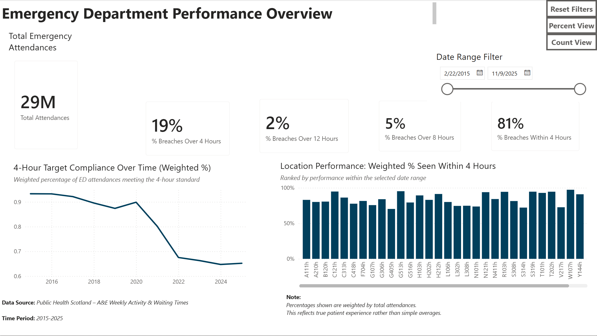
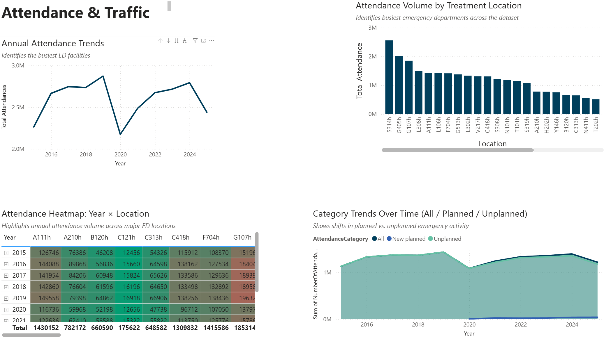

# Emergency Department Wait Times Analysis
📌 Project Overview

This project analyzes emergency department (A&E) wait-time performance using public NHS Scotland data. The objective was to assess operational pressure, patient flow trends, and compliance with national 4-hour performance targets.

🛠 Tools Used

MySQL — data cleaning and validation

SQL — date conversion, integrity checks, transformation

Power BI — data modeling, DAX calculations, interactive dashboard

📊 Dashboard Features

Executive-level KPI overview

Weighted % wait-time performance metrics

Attendance trend analysis

Drillthrough and interactive bookmarks

Custom tooltip pages

Multi-page report structure

📐 Analytical Approach

Performance percentages were weighted by total attendances to ensure metrics accurately reflect patient experience and operational load, avoiding distortion from simple averages.

📷 Dashboard Preview

💡 Key Insight

Weighted KPIs provide a more realistic representation of system pressure, especially during high-volume periods.
